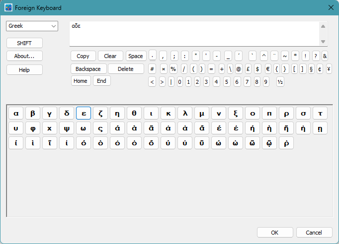

# Foreign Keyboard

A Windows desktop application that provides an on-screen virtual keyboard for typing characters from non-Latin scripts — Arabic, Farsi (Persian), Greek, Hebrew and Russian — without reconfiguring the operating system keyboard layout.

## Features

- **Five scripts supported:** Arabic, Farsi (Persian), Greek, Hebrew, Russian
- **Polytonic (ancient) Greek:** extended set of characters with diacritics — smooth/rough breathing, acute/grave/circumflex accents, iota subscript — for typing Classical and Byzantine Greek
- **Right-to-left (RTL) support:** the output text box automatically switches direction for Arabic, Farsi and Hebrew
- **Shift key:** toggles uppercase/lowercase for Greek and Russian
- **Physical keyboard pass-through:** typing A–Z and 0–9 on the real keyboard inserts the mapped foreign characters
- **60+ special character buttons:** punctuation, symbols, digits, currency signs and more
- **Clipboard integration:** one-click Copy button
- **Editing buttons:** Backspace, Delete, Home, End, Clear
- **Tooltips on every button:** hover the mouse to see the button name or character name (e.g. hovering over א shows "Alef")
- **CHM help file** accessible via the Help button

## Screenshots



## Requirements

- Windows 10 or Windows 11 (64-bit)
- Visual Studio 2022 or later with the **Desktop development with C++** workload (for building from source)

## Building from Source

1. Open `ForeignKeyboard.slnx` in Visual Studio 2022.
2. Select **x64 | Release** configuration.
3. Build the solution (**Ctrl+Shift+B**).

The executable is produced at `x64\Release\ForeignKeyboard.exe`.

### Building the Help File

HTML Help Workshop must be installed. Run:

```
"C:\Program Files (x86)\HTML Help Workshop\hhc.exe" help\ForeignKeyboard.hhp
```

This produces `help\ForeignKeyboard.chm`.

## Creating the Installer

Requires [Inno Setup 6](https://jrsoftware.org/isinfo.php) or later.

1. Build the Release executable (see above).
2. Build the CHM help file (see above).
3. Open `ForeignKeyboard.iss` in Inno Setup Compiler.
4. Press **Compile** (Ctrl+F9).

The installer is written to `Installer\ForeignKeyboard_Setup_1.0.exe`.

## Project Structure

```
ForeignKeyboard/
├── ForeignKeyboard.cpp          # Application entry point
├── ForeignKeyboard.h
├── ForeignKeyboardDlg.cpp       # Main dialog — all UI logic
├── ForeignKeyboardDlg.h
├── ForeignKeyboard.rc           # Dialog and resource definitions
├── resource.h                   # Resource IDs
├── ForeignKeyboard.vcxproj      # Visual Studio project file
├── ForeignKeyboard.slnx         # Visual Studio solution file
├── ForeignKeyboard.iss          # Inno Setup installer script
├── help/                        # CHM help source files
│   ├── ForeignKeyboard.hhp      # Help project
│   ├── ForeignKeyboard.hhc      # Table of contents
│   ├── ForeignKeyboard.hhk      # Index
│   ├── index.html
│   ├── overview.html
│   ├── languages.html
│   ├── keyboard_area.html
│   ├── special_buttons.html
│   └── physical_keyboard.html
└── res/
    ├── ForeignKeyboard.rc2
    └── ForeignKeyboardIcon.ico      # Application icon (app window, taskbar, desktop shortcut)
```

## Supported Scripts

| Language | Script | Direction | Case | Notes |
|---|---|---|---|---|
| Greek | Greek alphabet | Left to right | Upper & lower | Includes polytonic (ancient Greek) diacritics |
| Russian | Cyrillic | Left to right | Upper & lower | |
| Arabic | Arabic script | Right to left | — | |
| Hebrew | Hebrew script | Right to left | — | |
| Farsi (Persian) | Perso-Arabic | Right to left | — | |

## License

Copyright © 2026 Mika Huttunen. All rights reserved.
